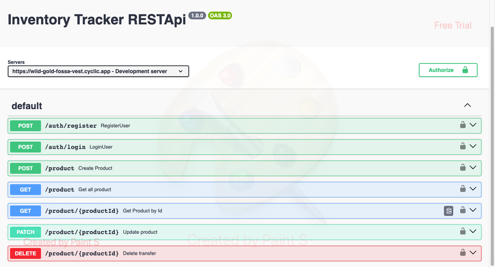

# Inventory Tracker RESTful API with expressjs, nodejs, and swagger

## Introduction

Welcome to the simple transfer app RESTful API website.

## RESTful Principles

The Financial Tracking API adheres to the principles of RESTful design to ensure a standardized and user-friendly experience:

1. **Resources**: The API treats financial entities such as transactions and accounts as resources, each accessible through a unique endpoint.

2. **HTTP Methods**: HTTP methods such as GET, POST, PUT, PATCH, and DELETE are employed to interact with these resources.

3. **Representation**: Data is exchanged in JSON format, allowing for structured and easy-to-parse information.


## Endpoints and Examples

[Copy me](https://wild-gold-fossa-vest.cyclic.app/)

### HTTP Methods

**Register New User**

```http
POST | https://wild-gold-fossa-vest.cyclic.app/auth/register
```

**Log In**

```http
POST | https://wild-gold-fossa-vest.cyclic.app/auth/register
```

**Post Transfer**

```http
POST | https://wild-gold-fossa-vest.cyclic.app/v1/transfers
```

**Get All Transfer**

```http
POST | https://wild-gold-fossa-vest.cyclic.app/v1/transfers/s
```

**Patching Transfer Status**

```http
PATCH | https://wild-gold-fossa-vest.cyclic.app/v1/transfers/:id
```

**Delete Transfer by ID**

```http
DELETE | https://wild-gold-fossa-vest.cyclic.app/v1/transfers/:id
```